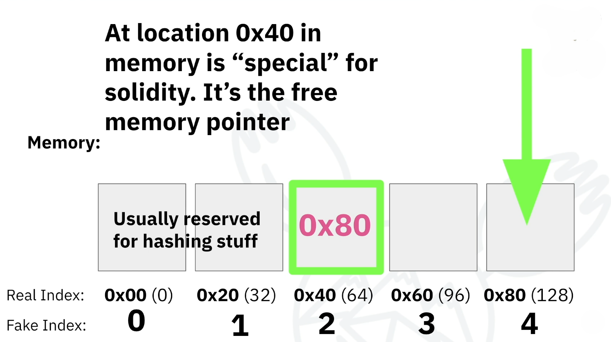

# Assembly, EVM Opcodes in Yul &amp; Huff

## Horse Store Contract 
### Opcodes Breakdowns in stack - [solc-breakdowns](https://github.com/adityaxxz/assembly-opcodes/blob/main/breakdowns/solc-breakdowns.c%2B%2B)

1. Write a basic simplestorage/horse store

2. Write horse store in Huff ✅
    1. Where did this data come from? How did remix know to send this data?

        - `cast sig "updateHorseNumber(uint256)"` gives output as `0xcdfead2e` 

        - **input** from remix (calldata): 0xcdfead2e0000000000000000000000000000000000000000000000000000000000000001

        - So, `0xcdfead2e` is known as function selector.

2. How does remix know to update the number of horses with this data?


### <ins>Function Dispatch/Method Dispatch:</ins> 
- The algorithm used to determine which functions/commands should be run/invoked in response to a message.

- In the EVM, this is when a smart contract uses the first 4 bytes of calldata to determine which function (which is a group of opcodes) to send the calldata to.


### <ins>Free Memory Pointer:</ins> 
- In solidity , free memory pointer allows to always keep track of where in memory array they can add something new.

- The memory index `0x40` is **special** in solidity , its where you check the *0x40 offset* of the memory array for the next free space.

<p align="center">


### <ins>Metadata: </ins>
- Inaccessible code which can never be reached by a transaction interact with smart contracts , some chunks of metadata that solidity puts in to identify things like what version,optimization , And how it was compiled etc.

- Often tools like Etherscan scans to actually verify, do verification to actually make sure the contract was compiled correctly.

### <ins>Precompiles: </ins>

- These are a special kind of contracts that are bundled with the EVM at fixed addresses , and can be called with a determined gas cost.

- The addresses start from 1(0x01) ,and increment for each contract. New hardforks may introduce new precompiled contracts.

- They are called from the opcodes like regular contracts, with instructions like [CALL](https://www.evm.codes/#F1).

- For all [precompiled contracts](https://www.evm.codes/precompiled), if the input is shorter than expected, it is assumed to be virtually padded with zeros at the end. If the input is longer than expected, surplus bytes at the end are ignored.


## Some commands used : 
```
cast sig "readNumberOfHorses()"   // returns function signature
cast to-base 0x80 10              // convert into decimal 
cast to-base 32 16                // convert into hexadecimal      

huffc src/horseStoreV1/HorseStore.huff -b
huffc src/horseStoreV1/HorseStore.huff --bin-runtime
forge test --match-path *Huff* --debug testReadValue -vvvv

```
